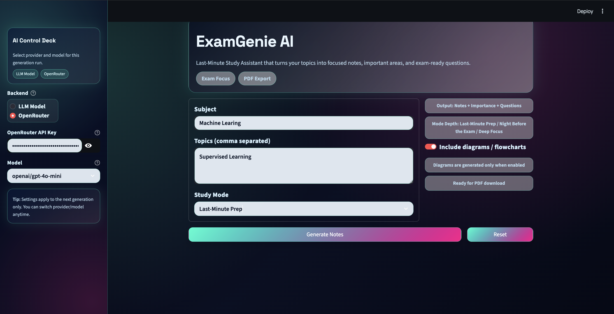

<div align="center">

# 🧠 ExamGenie AI

### *Your AI-powered exam prep companion — from syllabus to PDF in seconds.*

[](https://python.org)
[](https://streamlit.io)
[](https://openrouter.ai)
[](LICENSE)

</div>

---

## 🔗 Live Links

| | |
|---|---|
| 🚀 **Live App (Streamlit Cloud)** | [examgenie-ai.streamlit.app](https://examgenie-ai-muqeethomer.streamlit.app/) |
| 💻 **GitHub Repository** | [github.com/SyedMuqeeth23/ExamGenie-Ai](https://github.com/SyedMuqeeth23/ExamGenie-Ai) |

---

## ✨ What is ExamGenie?

ExamGenie AI takes your subject and topics, and runs them through a **multi-agent AI pipeline** to produce everything you need to ace your exam — structured notes, a ranked importance list, a question bank, topic mind maps, and a polished PDF. All powered by a local LLM or the OpenRouter cloud API.

> *Stop scrolling through slides. Just tell ExamGenie what to study.*

---

## � App Preview

<div align="center">

| | |
|:---:|:---:|
|  |  |
| **Home — Enter Subject & Topics** | **AI-Generated Notes** |
|  | |
| **Notes Generation** | |

</div>

> 💡 To add more screenshots: place image files in `Image/` and reference them in the preview table.

---

## �🚀 Features

| Feature | Description |
|---|---|
| 📋 **Syllabus Analysis** | Parses your subject units into a clean, deduplicated topic list |
| 🔬 **AI Research** | Generates concise academic summaries for every topic |
| 📝 **Smart Notes** | Produces structured study notes tailored to your chosen mode |
| ⭐ **Importance Ranking** | Scores and tags each topic by exam likelihood |
| ❓ **Question Bank** | SAQ, LAQ, and Code questions auto-generated per topic |
| 🗺️ **Topic Mind Maps** | Beautiful Mermaid-based visual diagrams of your subject |
| 📄 **PDF Export** | Everything compiled into a formatted, downloadable PDF |
| ⚡ **Dual Backend** | Local LM Studio model or OpenRouter cloud API — your choice |

---

## 🎯 Study Modes

Choose the intensity that matches your deadline:

| Mode | When to Use | Output |
|---|---|---|
| ⚡ **Last-Minute Prep** | Hours before the exam | High-yield bullets & shortcuts  |
| 🌙 **Night Before the Exam** | The evening before | Clear coverage + examples + checklist  |
| 🔭 **Deep Focus** | Days in advance | In-depth explanations, comparisons & memory aids  |

---

## 🏗️ How It Works

```
Your Input (Subject + Topics)
         │
         ▼
 ┌──────────────────┐
 │  Syllabus Agent  │  → Parses & cleans topic list
 └────────┬─────────┘
          ▼
 ┌──────────────────┐
 │  Research Agent  │  → Generates academic summaries per topic
 └────────┬─────────┘
          ▼
 ┌──────────────────┐
 │   Notes Agent    │  → Writes mode-aware structured notes
 └────────┬─────────┘
          ▼
 ┌──────────────────┐
 │ Importance Agent │  → Ranks & scores each topic
 └────────┬─────────┘
          ▼
 ┌──────────────────┐
 │ Question Agent   │  → SAQ + LAQ + Code questions
 └────────┬─────────┘
          ▼
 ┌──────────────────┐
 │  PDF Generator   │  → Beautiful downloadable PDF
 └──────────────────┘
```

---

## 📁 Project Structure

```
ExamGenie-Ai/
├── app.py                  # Streamlit UI & pipeline orchestration
├── configur.py             # LLM client setup (LM Studio / OpenRouter)
├── requirements.txt
├── Makefile
├── Agents/
│   ├── syllabus_agent.py   # Topic parsing
│   ├── research_agent.py   # Per-topic academic summaries
│   ├── notes_agent.py      # Mode-aware note generation
│   ├── importance_agent.py # Topic importance scoring
│   └── question_agent.py   # SAQ / LAQ / Code question generation
├── Utilies/
│   └── pdf_generator.py    # ReportLab PDF builder
├── Data/
│   └── knowledge.py
├── Image/                 # App screenshots used in README
├── docs/diagrams/          # Mermaid source & compiled diagram files
└── scripts/
    └── compile_diagrams.sh
```

---

## ⚙️ Setup

### Prerequisites

- Python 3.10+
- [LM Studio](https://lmstudio.ai/) running locally **or** an [OpenRouter](https://openrouter.ai/) API key
- Homebrew (macOS) for `cairosvg` native dependencies

### 1. Clone the repo

```bash
git clone https://github.com/SyedMuqeeth23/ExamGenie-Ai.git
cd ExamGenie-Ai
```

### 2. Create & activate a virtual environment

```bash
python3 -m venv .venv
source .venv/bin/activate
```

### 3. Install dependencies

```bash
make install
```

> **macOS note:** `cairosvg` requires native system libs:
> ```bash
> brew install cairo libffi
> export DYLD_LIBRARY_PATH=/opt/homebrew/lib
> ```

---

## 🔧 Configuration

### Local LLM (LM Studio) — default

Start LM Studio, load any chat model. The app auto-connects to `http://localhost:1234/v1`. No extra config needed.

### OpenRouter API

```bash
export OPENROUTER_API_KEY="your-key-here"
# Optional: override default model (gpt-4o-mini)
export OPENROUTER_MODEL="anthropic/claude-3-haiku"
```

Or paste your key directly in the app's sidebar.

---

## ▶️ Running the App

```bash
make run
```

This compiles Mermaid diagrams, then launches the Streamlit app at **http://localhost:8501**.

---

## 📖 Usage

1. Open **http://localhost:8501**
2. Enter a **subject name** — e.g. `Machine Learning`
3. Enter **topics / units**, one per line — e.g. `Neural Networks`, `Backpropagation`
4. Pick a **study mode**
5. Choose your **backend** in the sidebar
6. Hit **Generate** and watch the pipeline run
7. Download your **PDF** 🎉

---

## 📦 Dependencies

| Package | Purpose |
|---|---|
| `streamlit` | Web UI |
| `openai` | LLM API client (LM Studio & OpenRouter) |
| `reportlab` | PDF generation |
| `pillow` | Image processing |
| `cairosvg` | SVG rendering |

---

## 👤 Author

**Syed Muqeeth Omer Ahmed** — [github.com/SyedMuqeeth23](https://github.com/SyedMuqeeth23)

---

## 📄 License

MIT — free to use, modify, and distribute.
